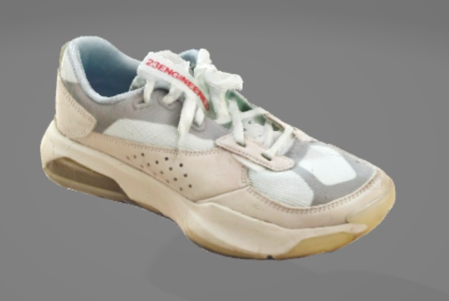

<html lang="en">
<head>
    <meta charset="UTF-8">
    <meta name="viewport" content="width=device-width, initial-scale=1.0">
    <title>Modele AR Showcase</title>
    
</head>
<body>

    

        
        
Jordan Air 200E (apasă pentru model 3D)

    

    

        
        
Noodle Pack (apasă pentru model 3D)

    

    

        
        
Nike Free Metcon (apasă pentru model 3D)

    

    

        
        
Guler Cervical (apasă pentru model 3D)

    

    

        
        
Nike AF1 (apasă pentru model 3D)

    

    

        
        
Scaun Ikea (apasă pentru model 3D)

    

</body>
</html>
